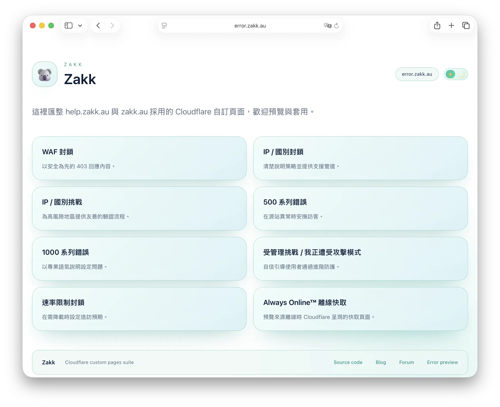
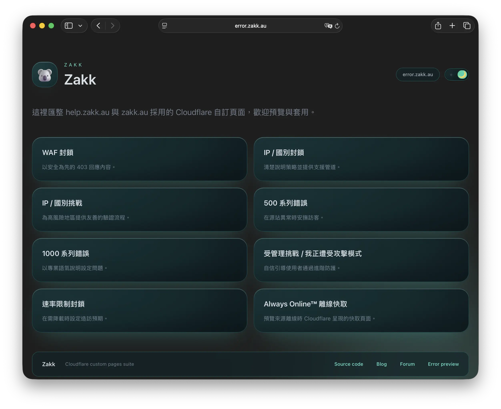
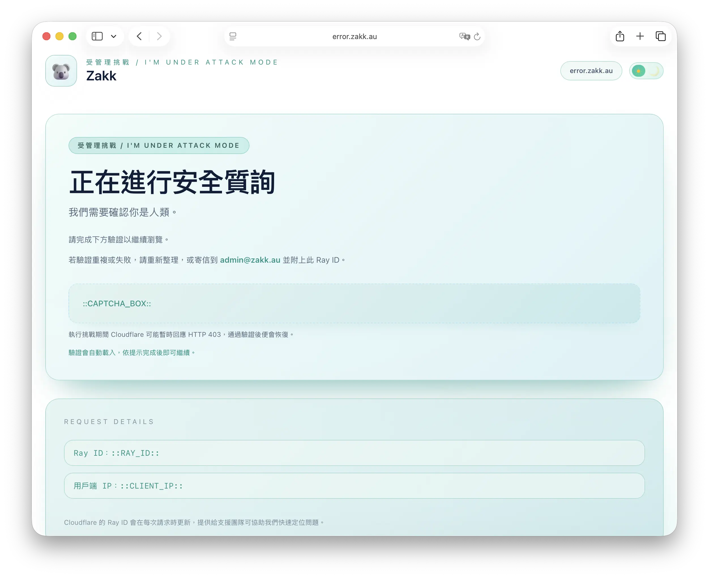
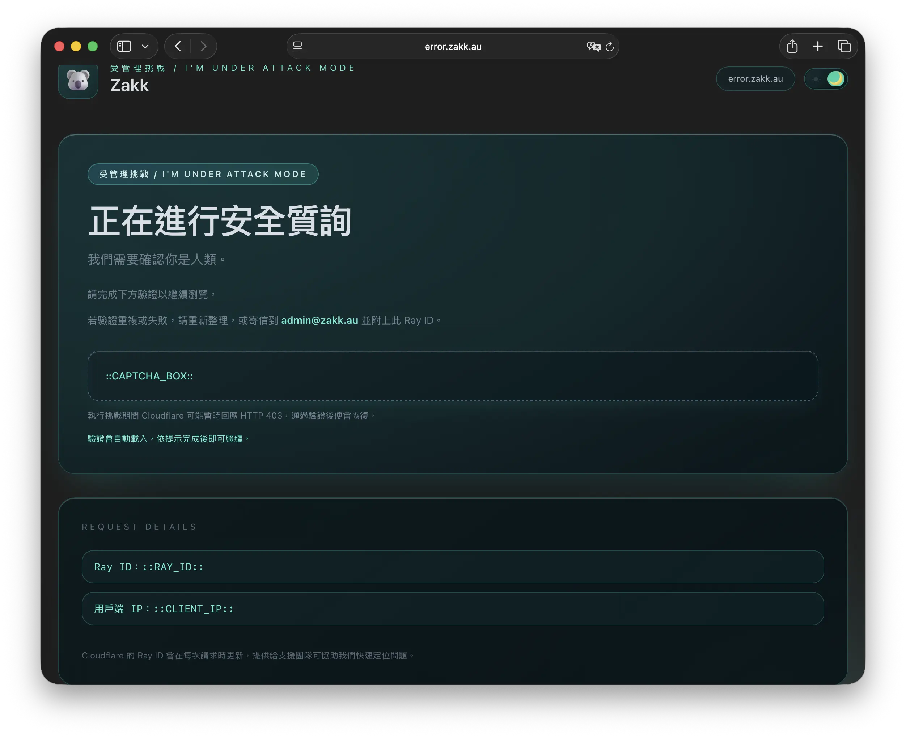

<div align="center">

# ☁️ Cloudflare Error Pages for error.zakk.au


*Beautiful, responsive error pages for Cloudflare with multi-language support*

</div>

---

<div align="center">

## 📋 Available Languages / 可用語言

| 🇺🇸 [English](#english) | 🇹🇼 [正體中文](#正體中文) | 🇨🇳 [简体中文](#简体中文) |
|:---:|:---:|:---:|

</div>

---

## 🇺🇸 English

<div align="center">

**🌐 Primary Address:** [https://error.zakk.au](https://error.zakk.au)

</div>

### ✨ Highlights

- Refined light theme with softened cards and a polished day/night toggle to match the latest brand palette.
- Responsive Tailwind CSS layouts with shared components used across help.zakk.au and zakk.au.
- Automatic locale detection (`en`, `zhHans`, `zhHant`) with per-language copy held in `lang.js`.
- Ray ID–aware support flows that prefill email tickets for faster troubleshooting.

### 📄 Included Templates

| File | Purpose |
| --- | --- |
| `cf-waf-block.html` | Web Application Firewall (403) block |
| `cf-ip-block.html` | IP / country block page |
| `cf-ip-challenge.html` | IP / country managed challenge (CAPTCHA) |
| `cf-500.html` | 500-class origin errors |
| `cf-1000.html` | 1000-class configuration errors |
| `cf-attack.html` | Managed challenge / I'm Under Attack Mode |
| `cf-rate-limit.html` | 429 rate limiting response |
| `offline.html` | Always Online™ fallback notice |

Every page renders the brand, category label, Ray ID and support link inside a compact card; Cloudflare injects Ray and client IP data at runtime.

### 🖼️ UI Gallery (WebP)

<div align="center">
  
  
</div>

<div align="center">
  
  
</div>

- **Homepage (light):** Main catalogue view with hero card, navigation, and new Always Online preview copy.
- **Homepage (dark):** Night theme showcasing the same layout with balanced contrast and glow accents.
- **Challenge (light):** Managed challenge flow displaying updated guidance and supportive messaging.
- **Challenge (dark):** Dark mode counterpart highlighting readability and focus on the verification widget.

### 🎨 Customise It

1. Update strings in `lang.js` to change tone, add locales or tweak mailto templates.
2. Swap `koala_3d.webp` and `logo.svg` with your own assets if you need different branding.
3. Adjust Tailwind utilities inside `input.css`, then rebuild the bundle so `output.css` stays in sync.

### 🔧 Build & Preview Locally

```powershell
npm install
npm run build
```

> 💡 **Tip:** Prefer pnpm? Swap in `pnpm install` and `pnpm run build`.

### 🚀 Deploy to Cloudflare Pages

1. Create a Pages project that points at this repository (production branch `main`).
2. Choose the **None** framework preset.
3. Set the build command to `npm run build`.
4. Keep the output directory as `/` because all HTML lives at the repository root.
5. Cloudflare installs dependencies and rebuilds the CSS on every commit.
6. Link the project to error.zakk.au via Custom Pages, or reuse the templates across help.zakk.au and zakk.au.

### 📄 License & Support

- Released under the [MIT License](LICENSE).
- Demo domain: `error.zakk.au`.

---

## 🇹🇼 正體中文

<div align="center">

**🌐 主要地址：** [https://error.zakk.au](https://error.zakk.au)

</div>

### ✨ 亮點摘要

- 全新調整的淺色模式與主題切換鈕，讓卡片與品牌色彩更柔和一致。
- 以 Tailwind CSS 建構響應式排版，並在 help.zakk.au 與 zakk.au 共用同一套元件。
- `lang.js` 自動偵測語系，提供英文、簡體中文、繁體中文即時切換。
- Ray ID 會自動帶入郵件支援流程，加速問題追蹤。

### 📄 模板一覽

| 檔案 | 用途 |
| --- | --- |
| `cf-waf-block.html` | WAF（403）封鎖頁 |
| `cf-ip-block.html` | IP / 國別封鎖頁 |
| `cf-ip-challenge.html` | IP / 國別管理式驗證（CAPTCHA）|
| `cf-500.html` | 500 系列來源錯誤 |
| `cf-1000.html` | 1000 系列配置錯誤 |
| `cf-attack.html` | 受管理挑戰／I'm Under Attack Mode |
| `cf-rate-limit.html` | 429 速率限制回應 |
| `offline.html` | Always Online™ 離線通知 |

所有頁面皆會顯示品牌、分類標籤、Ray ID 與支援連結，Cloudflare 會在執行時自動注入 Ray 與客戶端 IP。

### 🎨 如何自訂

1. 依品牌語氣調整 `lang.js` 字串，或新增需要的語系與郵件範本。
2. 若需替換品牌圖像，更新 `koala_3d.webp` 或 `logo.svg` 即可。
3. 在 `input.css` 微調 Tailwind 設定後重新編譯，以確保 `output.css` 同步。

### 🔧 本機建置與預覽

```powershell
npm install
npm run build
```

> 💡 **小提示：** 若偏好使用 pnpm，可改為執行 `pnpm install` 與 `pnpm run build`。

### 🚀 部署到 Cloudflare Pages

1. 在 Cloudflare Pages 建立新專案並串接此儲存庫（Production 分支維持 `main`）。
2. Framework preset 選擇 **None**。
3. Build command 填寫 `npm run build`。
4. 輸出目錄保持 `/`，因為 HTML 全部位於倉庫根目錄。
5. Cloudflare 會在每次 commit 後自動安裝依賴並重建樣式。
6. 透過 Custom Pages 將結果套用到 error.zakk.au，或在 help.zakk.au、zakk.au 之間共用。

### 📄 授權與支援

- 採用 [MIT 授權](LICENSE)。
- 示範網域：`error.zakk.au`。

---

## 🇨🇳 简体中文

<div align="center">

**🌐 主站地址：** [https://error.zakk.au](https://error.zakk.au)

</div>

### ✨ 亮点速览

- 全新优化的浅色主题与切换按钮，让卡片与品牌色调更和谐。
- 使用 Tailwind CSS 搭建的响应式布局，并在 help.zakk.au 与 zakk.au 上共享组件。
- `lang.js` 自动识别语言，提供英文、简体中文、繁体中文即时切换。
- Ray ID 自动带入邮件支援流程，加快排障速度。

### 📄 模板列表

| 文件 | 用途 |
| --- | --- |
| `cf-waf-block.html` | WAF（403）阻止页 |
| `cf-ip-block.html` | IP / 国家阻止页 |
| `cf-ip-challenge.html` | IP / 国家管理式验证（CAPTCHA）|
| `cf-500.html` | 500 系列源站错误 |
| `cf-1000.html` | 1000 系列配置错误 |
| `cf-attack.html` | Managed Challenge / I'm Under Attack Mode |
| `cf-rate-limit.html` | 429 速率限制响应 |
| `offline.html` | Always Online™ 离线提示 |

每个页面都会展示品牌、分类标签、Ray ID 与支援链接，Cloudflare 会在运行时注入 Ray 与客户端 IP。

### 🎨 自定义步骤

1. 在 `lang.js` 中调整文案、语气或新增语言与邮件模板。
2. 如需替换品牌视觉，更新 `koala_3d.webp` 或 `logo.svg` 即可。
3. 修改 `input.css` 里的 Tailwind 设置后重新编译，确保 `output.css` 最新。

### 🔧 本地构建与预览

```powershell
npm install
npm run build
```

> 💡 **小贴士：** 如果偏好 pnpm，可改用 `pnpm install` 与 `pnpm run build`。

### 🚀 部署到 Cloudflare Pages

1. 在 Cloudflare Pages 新建项目并关联此仓库（生产分支保持 `main`）。
2. Framework preset 选择 **None**。
3. 构建命令填写 `npm run build`。
4. 输出目录设为 `/`，因为 HTML 文件位于仓库根目录。
5. Cloudflare 会在每次提交后自动安装依赖并重建样式。
6. 通过 Custom Pages 将模板套用到 error.zakk.au，或在 help.zakk.au、zakk.au 之间共享。

### 📄 授权与支援

- 项目使用 [MIT 许可证](LICENSE)。
- 示范域名：`error.zakk.au`。

---

<div align="center">

## 🙏 Acknowledgments / 致謝 / 致谢

This project was inspired by and builds upon the excellent work of:

**Special thanks to:**

- 🌟 **[MrDemonWolf/cf-pages](https://github.com/MrDemonWolf/cf-pages)** - Original inspiration and foundation for this project
- ☁️ **[Cloudflare Workers](https://workers.cloudflare.com/)** - Providing the amazing serverless platform
- 🏗️ **[Cloudflare Pages](https://pages.cloudflare.com/)** - Hosting and deployment platform
- 🎨 **[Tailwind CSS](https://tailwindcss.com/)** - Utility-first foundation for all layout, spacing, and component styling
- 🦘 **[Microsoft Fluent UI Emoji](https://github.com/microsoft/fluentui-emoji)** - Adorable koala emoji bringing personality to error pages

### 🌐 Technology Stack


</div>
